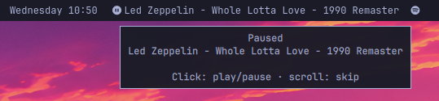

# Spotify

The song that's playing, right on the bar.



Click to pause. Scroll to skip. When Spotify is quiet, the chip is gone — it does not sit there saying nothing. Ads show up as Advertisement, not as whatever junk metadata the player emits.

Plugin id: `io.github.swadowmaster.spotify`

## How it works

Omarchy Quattro has no Waybar and no `playerctl`. This widget talks to Spotify through [MPRIS](https://wiki.archlinux.org/title/MPRIS), the same D-Bus interface the desktop already uses for media keys. Quickshell exposes it as `Quickshell.Services.Mpris`.

On each update it looks at every MPRIS player and keeps the first one whose identity, desktop entry, or D-Bus name contains `spotify`. Other players (browsers, VLC, Omarchy's own media module) are ignored.

If that player has a title or artist, the bar shows:

```
<play or pause icon>  Artist - Title  <Spotify icon>
```

Ads are detected from a track id that contains `:ad:` and shown as `Advertisement` instead of the ad metadata.

If Spotify is closed, or open but with no track, the widget sets its width to zero and disappears. It comes back by itself when playback starts. Nothing is written to disk and no extra process is spawned.

Controls (only while a track is visible):

| Input | Action |
|---|---|
| Left click | Play / pause |
| Scroll up or middle click | Previous track |
| Scroll down or right click | Next track |
| Hover | Playing/paused plus the same title |

## Install

Omarchy 4 (Quattro) only.

```bash
omarchy plugin add https://github.com/SwadowMaster/omarchy-spotify.git --enable
```

Optional placement:

```bash
omarchy bar move io.github.swadowmaster.spotify --section center
```

## Remove

```bash
omarchy plugin remove io.github.swadowmaster.spotify
```

That disables the widget and deletes the git checkout. It does not change other Omarchy settings.

## Requirements

- Omarchy 4 (Quattro)
- Spotify (or another player whose MPRIS identity/desktop/dbus name contains `spotify`)

No extra packages. `playerctl` is not required.

## License

MIT. See [LICENSE](LICENSE).
